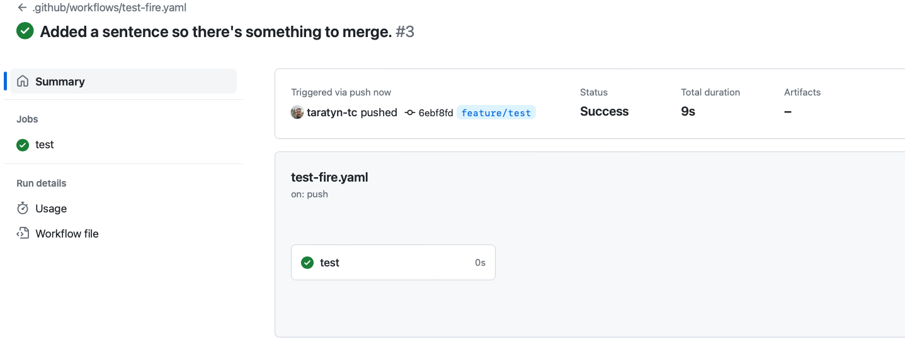
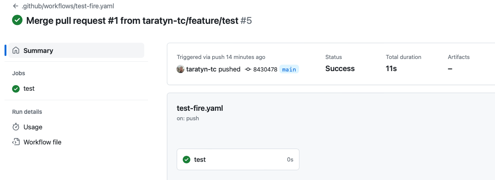
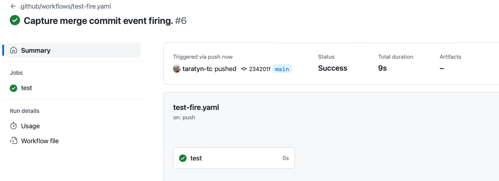

# test-workflow-push-trigger
Does a push event fire when I merge a PR?

This sentence was added in a branch and merged in a PR! See #1.

The Workflow is fired on the branch:

And it fired for the merge commit:

And it fires when you commit right on `main`:

